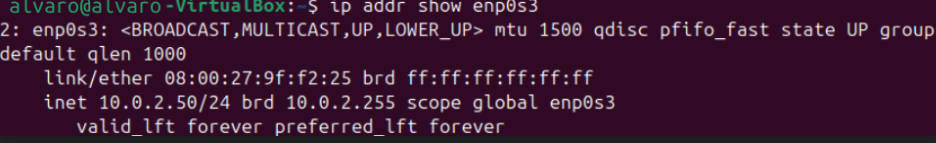

# 🌐 Proyecto Práctico - Infraestructura de Servidor Web y Servicios de Red (DAW 2025/26)

**Autor:** Álvaro  
**Sistema Operativo:** Ubuntu Desktop 24.04 LTS sobre VirtualBox  
**Configuración de red:** Adaptador Puente (Bridged Adapter)  
**IP del servidor:** 192.168.1.135  
**Dominio local:** marisma.local  
**Directorio del proyecto:** `~/infraestructura-web/`

---

## 📑 Índice

1. Preparación del entorno
2. Despliegue del stack Apache + PHP + MariaDB
3. Script de creación automática de clientes
4. FTP seguro, acceso SSH y soporte Python
5. Servidor DNS local con BIND9
6. Pruebas y verificación del sistema
7. Guía de uso del servidor
8. Arquitectura y servicios activos

---

## ⚙️ 1. Preparación del entorno

### 📝 Objetivo
Partir de un sistema limpio, actualizar los repositorios e instalar las herramientas de trabajo necesarias antes de comenzar el despliegue de servicios.

### 💻 Comandos ejecutados

```bash
sudo apt update && sudo apt upgrade -y

sudo apt install -y \
net-tools curl wget vim git unzip

mkdir -p ~/infraestructura-web/{scripts,images,backups}

cd ~/infraestructura-web
```

### ✅ Resultado
- Paquetes del sistema actualizados sin errores.
- Utilidades básicas disponibles.
- Conectividad de red verificada.
- Estructura de directorios del proyecto creada.

---

## 🌐 2. Despliegue del stack Apache + PHP + MariaDB

### 📝 Objetivo
Montar un entorno LAMP completo capaz de servir aplicaciones web dinámicas y gestionar bases de datos a través de phpMyAdmin.

### 💻 Instalación de paquetes

```bash
sudo apt install -y apache2 mariadb-server mariadb-client \
php php-cli php-mysql php-curl php-gd php-xml php-mbstring php-zip \
libapache2-mod-php phpmyadmin
```

### 🔧 Habilitación y configuración

```bash
sudo systemctl enable apache2 mariadb
sudo systemctl start apache2 mariadb

sudo a2enmod rewrite ssl
sudo systemctl restart apache2

sudo ln -s /etc/phpmyadmin/apache.conf \
/etc/apache2/conf-available/phpmyadmin.conf

sudo a2enconf phpmyadmin
sudo systemctl reload apache2
```

### ✅ Resultado
- Apache2 sirviendo peticiones en el puerto 80.
- PHP 8.3 integrado y operativo.
- MariaDB en funcionamiento.
- Interfaz phpMyAdmin accesible desde el navegador.

---

## 🤖 3. Script de creación automática de clientes

### 📝 Objetivo
Crear un script de bash que, dado un nombre de cliente, genere de forma automática todos los recursos necesarios para alojar su sitio web en el servidor.

### 📂 Ubicación del script

```
~/infraestructura-web/scripts/crear_cliente.sh
```

### ▶️ Modo de uso

```bash
sudo ./crear_cliente.sh cliente1 192.168.1.135
```

### ✅ Tareas que realiza el script
- Alta del usuario en el sistema Linux
- Creación del directorio web correspondiente
- Generación de página de inicio por defecto
- Registro del VirtualHost en Apache
- Añadido automático de la entrada DNS
- Creación de la base de datos y usuario MySQL asociado
- Generación de una contraseña aleatoria segura

---

## 🔐 4. FTP seguro, acceso SSH y soporte Python

### 📝 Objetivo
Habilitar transferencia de ficheros cifrada y acceso remoto por consola, además de dar soporte a aplicaciones Python a través de Apache.

### 📦 Paquetes instalados

```bash
sudo apt install -y \
vsftpd \
openssh-server \
libapache2-mod-wsgi-py3
```

### 🔧 Ajustes en vsftpd

**Archivo de configuración:** `/etc/vsftpd.conf`

**Parámetros clave:**
```
ssl_enable=YES
chroot_local_user=YES
```

### 🔥 Apertura de puertos en el firewall

```bash
sudo ufw allow 21/tcp
sudo ufw allow 22/tcp
sudo ufw allow 40000:40100/tcp
```

### 🐍 Módulo WSGI para Python

```bash
sudo a2enmod wsgi
sudo systemctl reload apache2
```

### ✅ Resultado
- Transferencias FTP cifradas con TLS.
- SSH y SFTP disponibles para todos los clientes.
- Aplicaciones Python desplegables a través de mod_wsgi.

---

## 🌍 5. Servidor DNS local con BIND9

### 📝 Objetivo
Configurar un servidor DNS autoritativo para el dominio `marisma.local`, con resolución tanto directa como inversa, e integrado con el script de clientes.

### 📦 Instalación

```bash
sudo apt install -y \
bind9 bind9-utils bind9-doc dnsutils
```

### 🔧 Zonas definidas

**Fichero principal:** `/etc/bind/named.conf.local`

**Zonas configuradas:**
- `marisma.local` → resolución directa
- `1.168.192.in-addr.arpa` → resolución inversa

### 🧪 Comprobación de sintaxis

```bash
sudo named-checkconf

sudo named-checkzone marisma.local \
/etc/bind/db.marisma.local
```

### 🔍 Pruebas de resolución

```bash
dig @192.168.1.135 cliente1.marisma.local

dig @192.168.1.135 -x 192.168.1.135
```

### ✅ Resultado
- Resolución directa operativa.
- Resolución inversa configurada y funcional.
- El script de clientes actualiza las zonas DNS de forma automática.

---

## 🧪 6. Pruebas y verificación del sistema

### 📋 Estado de los servicios

```bash
sudo systemctl status \
apache2 mariadb named vsftpd ssh
```

### 🌐 Comprobación HTTP

```bash
curl http://192.168.1.135
```

### 🗄️ Comprobación de bases de datos

```bash
sudo mysql -e "SHOW DATABASES;"
```

### 🌍 Resolución DNS

```bash
dig @192.168.1.135 cliente1.marisma.local +short
```

### 🔐 Acceso SSH

```bash
ssh cliente1@192.168.1.135
```

### ✅ Conclusión
Todos los servicios respondieron correctamente durante las pruebas, confirmando la integración completa del entorno.

---

## 🚀 Guía de uso del servidor

### Alta de un nuevo cliente

```bash
sudo ~/infraestructura-web/scripts/crear_cliente.sh empresa 192.168.1.135
```

### Recursos generados automáticamente
- Usuario Linux del sistema
- Directorio web propio
- VirtualHost en Apache
- Subdominio DNS registrado
- Base de datos exclusiva
- Usuario MySQL con permisos sobre su BD
- Contraseña segura generada al momento

### 🌐 Puntos de acceso disponibles

| Recurso | Dirección |
|---|---|
| Sitio web del cliente | `http://empresa.marisma.local` |
| phpMyAdmin | `http://192.168.1.135/phpmyadmin` |
| Consola SSH | `ssh empresa@192.168.1.135` |
| Transferencia SFTP | `sftp empresa@192.168.1.135` |

---

## 🏗️ Resumen de la arquitectura

| Servicio | Tecnología | Puerto |
|---|---|---|
| Servidor Web | Apache2 | 80 / 443 |
| Motor PHP | PHP 8.3 | Interno |
| Base de Datos | MariaDB | 3306 |
| DNS | BIND9 | 53 |
| FTP Seguro | vsftpd | 21 |
| Acceso remoto | OpenSSH | 22 |
| Apps Python | mod_wsgi | Apache |

---

## 🔒 Seguridad implementada

- Cifrado TLS en las conexiones FTP
- Jaula chroot por usuario para evitar acceso al sistema de ficheros
- Acceso remoto exclusivamente por SSH/SFTP
- Contraseñas generadas aleatoriamente en cada alta
- Base de datos independiente por cliente
- Validación de zonas DNS antes de aplicar cambios
- Permisos restrictivos sobre los directorios web

---

## 📁 Estructura del proyecto

```
~/infraestructura-web/
├── README.md
├── scripts/
├── images/
└── backups/
```

---

## ✅ Objetivos completados

- ✔ Servidor web instalado y configurable por cliente
- ✔ Soporte para sitios estáticos y dinámicos
- ✔ Automatización completa mediante scripts bash
- ✔ Resolución DNS local operativa
- ✔ MariaDB integrado con phpMyAdmin
- ✔ FTP cifrado con TLS
- ✔ SSH y SFTP habilitados
- ✔ Aplicaciones Python via mod_wsgi
- ✔ VirtualHosts generados automáticamente
- ✔ Gestión multiusuario implementada

---

## 🎓 Entorno utilizado

- Ubuntu 24.04 LTS
- VirtualBox con adaptador en modo puente
- Arquitectura x86_64
- Dominio local: `marisma.local`

---

## 📌 Estado final del proyecto

| Componente | Estado |
|---|---|
| Apache | ✅ Correcto |
| DNS (BIND9) | ✅ Correcto |
| Bases de datos | ✅ Operativas |
| VirtualHosts | ✅ Funcionando |
| FTP / SSH | ✅ Activos |
| Automatización | ✅ Implementada |
