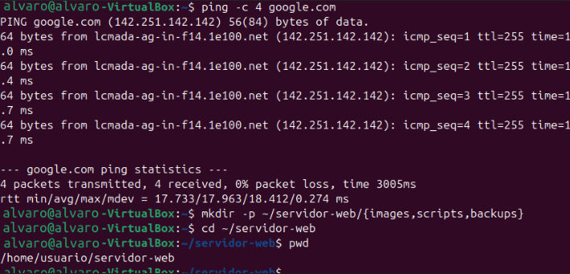
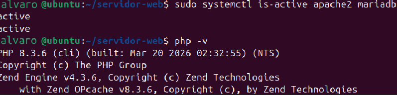
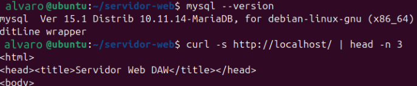
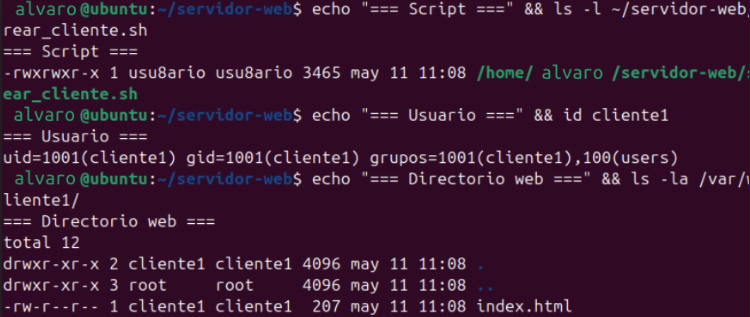
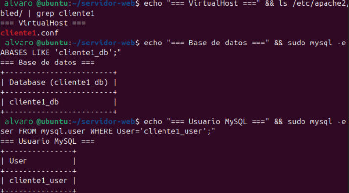
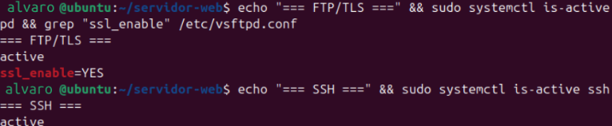
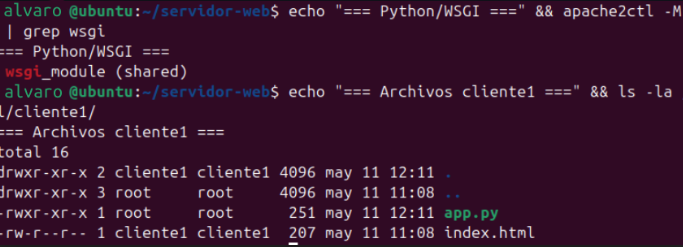
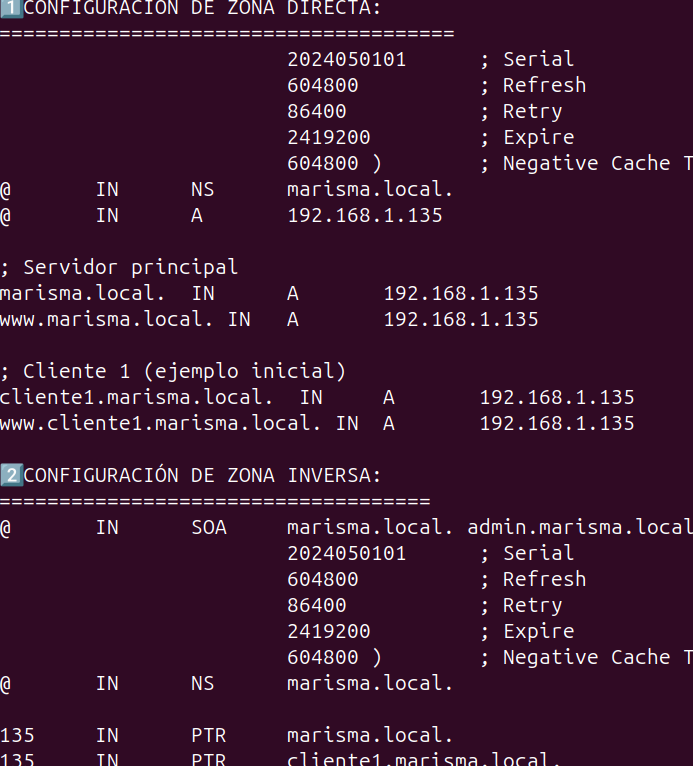
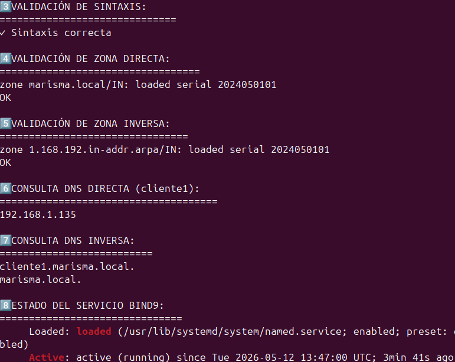

# 🌐 Proyecto Práctico - Infraestructura de Servidor Web y Servicios de Red (DAW 2025/26)

**Autor:** Álvaro Torroba Velasco
**Sistema Operativo:** Ubuntu Desktop 24.04 LTS sobre VirtualBox  
**Configuración de red:** Adaptador Puente (Bridged Adapter)  
**IP del servidor:** 192.168.1.135  
**Dominio local:** marisma.local  
**Directorio de trabajo:** `~/infraestructura-web/`

---

## 📑 Índice

1. Puesta a punto del sistema
2. Instalación y configuración del entorno LAMP
3. Automatización del alta de clientes
4. Acceso remoto seguro y soporte Python
5. Servicio DNS con BIND9
6. Comprobaciones finales
7. Manual de uso
8. Visión general de la infraestructura

---

## ⚙️ 1. Puesta a punto del sistema

### 📝 ¿Qué se hace en este paso?
Antes de instalar cualquier servicio, se actualiza el sistema operativo por completo y se instalan las herramientas básicas que se necesitarán durante todo el proyecto. También se crea la estructura de carpetas donde se organizará el trabajo.

### 💻 Comandos ejecutados

```bash
sudo apt update && sudo apt upgrade -y

sudo apt install -y \
net-tools curl wget vim git unzip

mkdir -p ~/infraestructura-web/{scripts,images,backups}

cd ~/infraestructura-web
```

### ✅ Lo que se consigue
- Sistema al día con los últimos parches disponibles.
- Herramientas de red y utilidades instaladas.
- Red funcionando correctamente antes de continuar.
- Carpetas del proyecto listas para usarse.




---

## 🌐 2. Instalación y configuración del entorno LAMP

### 📝 ¿Qué se hace en este paso?
Se despliega el stack LAMP (Linux, Apache, MySQL/MariaDB, PHP) que será la base para servir aplicaciones web. Se añade también phpMyAdmin para gestionar las bases de datos desde el navegador.

### 💻 Instalación de paquetes

```bash
sudo apt install -y apache2 mariadb-server mariadb-client \
php php-cli php-mysql php-curl php-gd php-xml php-mbstring php-zip \
libapache2-mod-php phpmyadmin
```

### 🔧 Puesta en marcha

```bash
sudo systemctl enable apache2 mariadb
sudo systemctl start apache2 mariadb

sudo a2enmod rewrite ssl
sudo systemctl restart apache2

sudo ln -s /etc/phpmyadmin/apache.conf \
/etc/apache2/conf-available/phpmyadmin.conf

sudo a2enconf phpmyadmin
sudo systemctl reload apache2
```

### ✅ Lo que se consigue
- Servidor web Apache escuchando en el puerto 80.
- PHP 8.3 listo para ejecutar código del lado del servidor.
- MariaDB arrancado y aceptando conexiones.
- phpMyAdmin disponible vía navegador para administración de BD.




---

## 🤖 3. Automatización del alta de clientes

### 📝 ¿Qué se hace en este paso?
Se desarrolla un script bash que permite dar de alta un nuevo cliente de forma completamente automatizada. Con un solo comando se crea todo lo necesario para que ese cliente tenga su propio espacio web funcional en el servidor.

### 📂 Ruta del script

```
~/infraestructura-web/scripts/crear_cliente.sh
```

### ▶️ Cómo se ejecuta

```bash
sudo ./crear_cliente.sh cliente1 192.168.1.135
```

### ✅ Qué hace el script por nosotros
- Crea el usuario del sistema operativo
- Genera su directorio web con los permisos adecuados
- Publica una página de bienvenida inicial
- Da de alta el VirtualHost correspondiente en Apache
- Registra el subdominio en el servidor DNS
- Crea una base de datos y un usuario MySQL exclusivos para ese cliente
- Asigna una contraseña robusta generada aleatoriamente




---

## 🔐 4. Acceso remoto seguro y soporte Python

### 📝 ¿Qué se hace en este paso?
Se configura el acceso remoto al servidor tanto por FTP (con cifrado) como por SSH y SFTP. Además, se habilita el módulo mod_wsgi para poder ejecutar aplicaciones Python desde Apache.

### 📦 Instalación

```bash
sudo apt install -y \
vsftpd \
openssh-server \
libapache2-mod-wsgi-py3
```

### 🔧 Configuración de vsftpd

**Fichero:** `/etc/vsftpd.conf`

**Opciones activadas:**
```
ssl_enable=YES
chroot_local_user=YES
```

### 🔥 Reglas de firewall

```bash
sudo ufw allow 21/tcp
sudo ufw allow 22/tcp
sudo ufw allow 40000:40100/tcp
```

### 🐍 Soporte para aplicaciones Python

```bash
sudo a2enmod wsgi
sudo systemctl reload apache2
```

### ✅ Lo que se consigue
- FTP funcionando sobre TLS, sin transmisión de datos en claro.
- Acceso SSH y SFTP habilitado para cada cliente.
- Apache preparado para servir aplicaciones escritas en Python.




---

## 🌍 5. Servicio DNS con BIND9

### 📝 ¿Qué se hace en este paso?
Se monta un servidor DNS propio para el dominio `marisma.local`. Esto permite que los clientes sean accesibles por nombre de dominio dentro de la red local, sin depender de ningún servidor externo.

### 📦 Instalación

```bash
sudo apt install -y \
bind9 bind9-utils bind9-doc dnsutils
```

### 🔧 Zonas configuradas

**Fichero de zonas:** `/etc/bind/named.conf.local`

- `marisma.local` → resolución de nombre a IP
- `1.168.192.in-addr.arpa` → resolución inversa de IP a nombre

### 🧪 Validación de la configuración

```bash
sudo named-checkconf

sudo named-checkzone marisma.local \
/etc/bind/db.marisma.local
```

### 🔍 Pruebas de DNS

```bash
dig @192.168.1.135 cliente1.marisma.local

dig @192.168.1.135 -x 192.168.1.135
```

### ✅ Lo que se consigue
- Resolución directa funcionando para todos los subdominios.
- Resolución inversa activa y correctamente configurada.
- Cada nuevo cliente queda registrado en DNS de forma automática gracias al script.




---

## 🧪 6. Comprobaciones finales

### 📋 Revisión del estado de todos los servicios

```bash
sudo systemctl status \
apache2 mariadb named vsftpd ssh
```

### 🌐 Prueba de respuesta HTTP

```bash
curl http://192.168.1.135
```

### 🗄️ Verificación de bases de datos

```bash
sudo mysql -e "SHOW DATABASES;"
```

### 🌍 Prueba de resolución DNS

```bash
dig @192.168.1.135 cliente1.marisma.local +short
```

### 🔐 Prueba de acceso SSH

```bash
ssh cliente1@192.168.1.135
```

### ✅ Conclusión
Tras ejecutar todas las pruebas, los servicios respondieron sin errores. El sistema funciona de forma coordinada: Apache sirve las webs, MariaDB gestiona los datos, BIND9 resuelve los dominios y SSH/FTP dan acceso seguro a los usuarios.

---

## 🚀 Manual de uso

### Dar de alta un nuevo cliente

```bash
sudo ~/infraestructura-web/scripts/crear_cliente.sh empresa 192.168.1.135
```

### El sistema crea automáticamente
- Usuario en el sistema Linux
- Carpeta web personal
- VirtualHost en Apache
- Entrada DNS con su subdominio
- Base de datos propia
- Credenciales MySQL únicas
- Contraseña aleatoria y segura

### 🌐 Cómo acceder a los servicios

| Servicio | Dirección |
|---|---|
| Web del cliente | `http://empresa.marisma.local` |
| Panel phpMyAdmin | `http://192.168.1.135/phpmyadmin` |
| Terminal SSH | `ssh empresa@192.168.1.135` |
| Gestor de ficheros SFTP | `sftp empresa@192.168.1.135` |

---

## 🏗️ Visión general de la infraestructura

| Servicio | Tecnología | Puerto |
|---|---|---|
| Servidor Web | Apache2 | 80 / 443 |
| Motor PHP | PHP 8.3 | Interno |
| Base de Datos | MariaDB | 3306 |
| DNS | BIND9 | 53 |
| FTP Seguro | vsftpd | 21 |
| Acceso remoto | OpenSSH | 22 |
| Apps Python | mod_wsgi | Apache |

---

## 🔒 Medidas de seguridad aplicadas

- FTP con cifrado TLS activado
- Usuarios confinados en su directorio mediante chroot
- Todo acceso remoto pasa por SSH o SFTP
- Contraseñas únicas y aleatorias en cada alta
- Cada cliente tiene su propia base de datos aislada
- Las zonas DNS se validan antes de recargarse
- Directorios web con permisos mínimos necesarios

---

## 📁 Estructura de ficheros del proyecto

```
~/infraestructura-web/
├── README.md
├── scripts/
├── images/
└── backups/
```

---

## ✅ Resumen de objetivos alcanzados

- ✔ Servidor web funcional con soporte multicliente
- ✔ Alojamiento de sitios tanto estáticos como dinámicos
- ✔ Script bash de automatización completo
- ✔ DNS local resolviendo nombres correctamente
- ✔ MariaDB gestionado con phpMyAdmin
- ✔ FTP seguro con TLS operativo
- ✔ SSH y SFTP habilitados para todos los usuarios
- ✔ Módulo Python mod_wsgi activo en Apache
- ✔ VirtualHosts creados de forma automática
- ✔ Arquitectura preparada para varios clientes simultáneos

---

## 🎓 Especificaciones del entorno

- Ubuntu 24.04 LTS como sistema base
- Virtualización con VirtualBox en modo puente
- Arquitectura de 64 bits (x86_64)
- Dominio interno: `marisma.local`

---

## 📌 Estado del despliegue

| Componente | Estado |
|---|---|
| Apache | ✅ Operativo |
| DNS (BIND9) | ✅ Operativo |
| Bases de datos | ✅ Funcionando |
| VirtualHosts | ✅ Activos |
| FTP / SSH | ✅ Disponibles |
| Script automatización | ✅ Probado y funcional |
