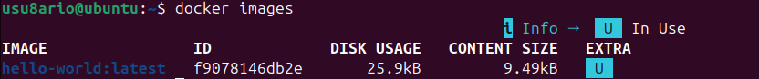

# Docker - Actividad 1: Instalación

## Introducción

En esta práctica se lleva a cabo la instalación de **Docker CE** sobre un sistema Ubuntu 24.04, comprobando al final que el entorno queda operativo y listo para trabajar con contenedores.

---

## Recursos consultados

- https://docs.docker.com/install/linux/docker-ce/ubuntu/
- https://medium.com/@Grigorkh/how-to-install-docker-on-ubuntu-16-04-3f509070d29c
- https://www.tecmint.com/install-docker-and-run-docker-containers-in-ubuntu/

---

## Proceso de instalación

### Paso 1 - Actualización del sistema

Antes de instalar cualquier paquete, actualizamos los repositorios y los paquetes existentes:

```bash
sudo apt update
sudo apt upgrade -y
```

---

### Paso 2 - Instalación de dependencias

Docker necesita una serie de paquetes previos para poder añadir su repositorio de forma segura:

```bash
sudo apt install -y \
    apt-transport-https \
    ca-certificates \
    curl \
    gnupg \
    lsb-release
```

---

### Paso 3 - Clave GPG oficial de Docker

Descargamos e importamos la clave GPG para verificar la autenticidad de los paquetes:

```bash
curl -fsSL https://download.docker.com/linux/ubuntu/gpg | sudo gpg --dearmor -o /usr/share/keyrings/docker-archive-keyring.gpg
```

---

### Paso 4 - Añadir el repositorio de Docker

Agregamos el repositorio estable de Docker a las fuentes de apt:

```bash
echo \
  "deb [arch=amd64 signed-by=/usr/share/keyrings/docker-archive-keyring.gpg] https://download.docker.com/linux/ubuntu \
  $(lsb_release -cs) stable" | sudo tee /etc/apt/sources.list.d/docker.list > /dev/null
```

---

### Paso 5 - Instalar Docker Engine

Con el repositorio ya configurado, instalamos Docker y sus componentes:

```bash
sudo apt update
sudo apt install -y docker-ce docker-ce-cli containerd.io docker-compose-plugin
```

---

### Paso 6 - Comprobar la versión instalada

```bash
docker --version
```

Salida obtenida:
```
Docker version 29.4.3, build 055a478
```


---

### Paso 7 - Ejecutar Docker sin sudo

Por defecto Docker requiere permisos de superusuario. Para evitarlo, añadimos nuestro usuario al grupo `docker`:

```bash
sudo groupadd docker
sudo usermod -aG docker $USER
newgrp docker
```

---

### Paso 8 - Prueba con el contenedor hello-world

```bash
docker run hello-world
```

Salida esperada:
```
Unable to find image 'hello-world:latest' locally
latest: Pulling from library/hello-world
...
Hello from Docker!
This message shows that your installation appears to be working correctly.
```

---

## Verificaciones

### Estado del servicio

```bash
sudo systemctl status docker
```

La línea clave que indica que todo funciona correctamente es:

```
Active: active (running)
```


---

### Información del sistema Docker

```bash
docker info
```

Muestra información detallada sobre el cliente y el servidor Docker, incluyendo versión, número de contenedores e imágenes, driver de almacenamiento, etc.


---

### Listar contenedores

```bash
docker ps -a
```


---

### Listar imágenes descargadas

```bash
docker images
```



---

## Configuración adicional

### Arranque automático con el sistema

Para que Docker se inicie automáticamente cada vez que arranque el equipo:

```bash
sudo systemctl enable docker
```

---

## Problemas encontrados y soluciones

### Permission denied al conectar con docker.sock

Si aparece el siguiente error:
```
permission denied while trying to connect to the Docker daemon socket at unix:///var/run/docker.sock
```

La solución es añadir el usuario al grupo docker y reiniciar la sesión:
```bash
sudo groupadd docker
sudo usermod -aG docker $USER
newgrp docker
```

---

### El daemon de Docker no responde

```bash
sudo systemctl restart docker
sudo systemctl status docker
```

---

### Fallo al descargar imágenes

Si aparece un error de DNS al intentar descargar imágenes, verificar la conexión a internet o configurar un DNS alternativo en `/etc/docker/daemon.json`.

---

## Resumen de componentes instalados

| Componente | Versión | Estado |
|---|---|---|
| Docker Engine | 29.4.3 | Activo |
| Docker CLI | 29.4.3 | Funcional |
| Containerd | - | Instalado |
| Docker Compose Plugin | v2.x | Disponible |
| Sistema operativo | Ubuntu 24.04 | Compatible |

---

## Capturas de pantalla

| Archivo | Descripción |
|---|---|
| `docker-version.png` | Versión de Docker instalada |
| `docker-status.png` | Estado del servicio |
| `docker-info.png` | Información del sistema |
| `docker-ps.png` | Listado de contenedores |
| `docker-images.png` | Listado de imágenes |

---

## Conclusión

La instalación de Docker CE en Ubuntu 24.04 se completó sin incidencias. El entorno queda operativo y configurado para trabajar con contenedores sin necesidad de usar `sudo`. En las siguientes actividades se profundizará en el uso de contenedores e imágenes.

---

**Álvaro Torroba Velasco**  
**Curso 2025/26**
