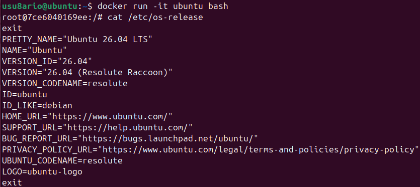
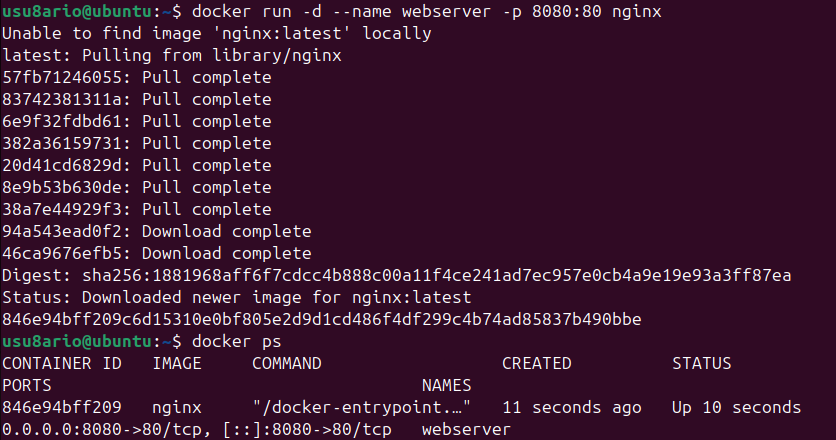
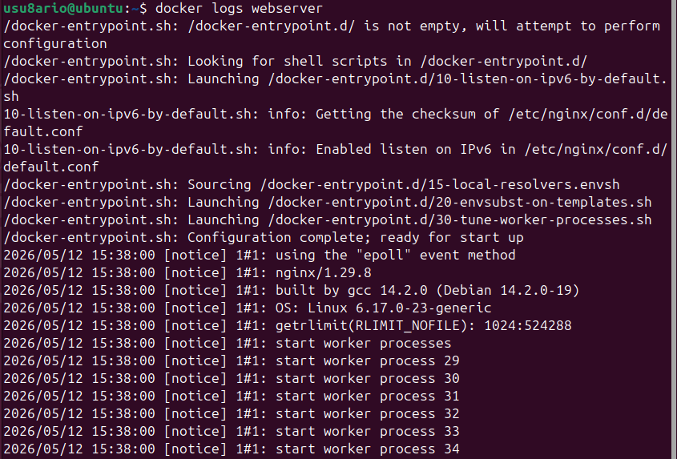
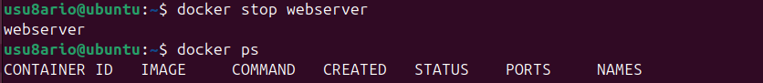
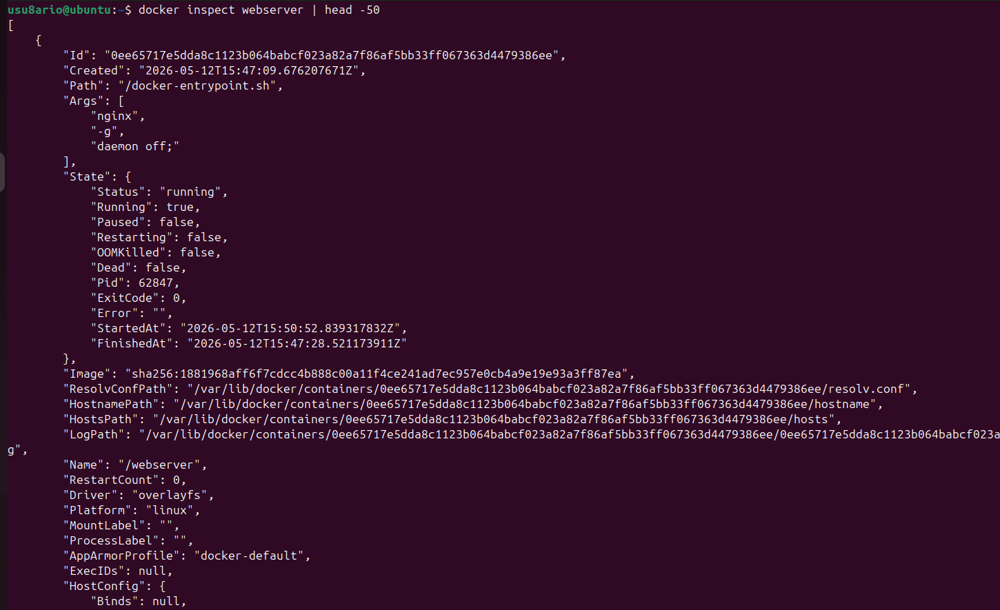
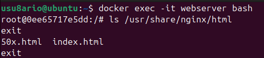
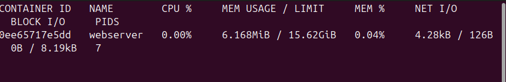

# Docker - Actividad 2: Gestión de contenedores

## Introducción

En esta práctica se trabaja con el **ciclo de vida de los contenedores Docker**: cómo crearlos, ejecutarlos en distintos modos, inspeccionarlos y detenerlos. Se utilizan imágenes como Ubuntu y Nginx para ilustrar los diferentes casos de uso.

---

## Recursos consultados

- https://docs.docker.com/engine/reference/
- https://github.com/josedom24/curso_docker_ies
- https://training.play-with-docker.com/

---

## Conceptos previos

**Contenedor:** proceso aislado que representa una instancia en ejecución de una imagen Docker.

**Modo interactivo (`-it`):** conecta la terminal del usuario con la entrada/salida del contenedor. Se usa para explorar o ejecutar shells.

**Modo segundo plano (`-d`):** el contenedor corre de forma desatendida sin bloquear la terminal.

**Mapeo de puertos (`-p`):** enlaza un puerto del host con un puerto interno del contenedor. Formato: `-p host:contenedor`.

---

## Desarrollo de la práctica

### 1. Contenedor Ubuntu en modo interactivo

```bash
docker run -it ubuntu bash
```

Una vez dentro, comprobamos la versión del sistema operativo:

```bash
cat /etc/os-release
```

Para salir del contenedor:

```bash
exit
```



---

### 2. Nginx en segundo plano con puerto mapeado

```bash
docker run -d --name webserver -p 8080:80 nginx
```

- `-d` ejecuta el contenedor en background
- `--name webserver` le asigna un nombre identificativo
- `-p 8080:80` expone el puerto 80 del contenedor en el 8080 del host

Verificamos que está corriendo:

```bash
docker ps
```



---

### 3. Consultar los logs del contenedor

```bash
docker logs webserver
```

Para seguir los logs en tiempo real:

```bash
docker logs -f webserver
```

Interrumpir con Ctrl+C.



---

### 4. Comprobar el acceso al servicio

Desde la terminal:

```bash
curl http://localhost:8080 | head -20
```

O desde el navegador accediendo a `http://localhost:8080`.


---

### 5. Lanzar varios contenedores con nombre

```bash
docker run --name hello1 hello-world
docker run --name hello2 hello-world
docker run --name hello3 hello-world
```

Cada ejecución muestra el mensaje de bienvenida de hello-world.


---

### 6. Ver todos los contenedores

```bash
docker ps -a
```

Con `-a` se listan también los contenedores que ya han terminado o están detenidos.


---

### 7. Detener un contenedor

```bash
docker stop webserver
```

Comprobamos que ya no aparece en los contenedores activos:

```bash
docker ps
```



---

### 8. Arrancar un contenedor detenido

```bash
docker start webserver
```

Verificamos que vuelve a estar activo:

```bash
docker ps
```


---

### 9. Inspeccionar un contenedor

```bash
docker inspect webserver
```

Devuelve un JSON completo con toda la información del contenedor: red, puertos, volúmenes, variables de entorno, estado, etc.



---

### 10. Ejecutar un comando dentro del contenedor sin entrar

```bash
docker exec webserver ls -la /usr/share/nginx/html
```


---

### 11. Acceder de forma interactiva a un contenedor en marcha

```bash
docker exec -it webserver bash
```

Desde dentro podemos ejecutar comandos como si fuéramos un usuario del sistema:

```bash
ls /usr/share/nginx/html
cat /usr/share/nginx/html/index.html
exit
```



---

### 12. Listado final de contenedores

```bash
docker ps -a
```


---

### 13. Estadísticas en tiempo real (opcional)

```bash
docker stats webserver
```

Muestra el consumo de CPU, memoria, red y disco del contenedor en vivo. Se interrumpe con Ctrl+C.



---

## Ciclo de vida de un contenedor

```
Creado → En ejecución → Detenido → Eliminado
         (run/start)    (stop)      (rm)
              ↕
           Pausado
           (pause)
```

---

## Tabla de comandos

| Comando | Función |
|---|---|
| `docker run -it` | Ejecutar en modo interactivo |
| `docker run -d` | Ejecutar en segundo plano |
| `docker run -p` | Mapear puertos |
| `docker run --name` | Asignar nombre |
| `docker ps` | Listar contenedores activos |
| `docker ps -a` | Listar todos los contenedores |
| `docker logs` | Ver salida del contenedor |
| `docker logs -f` | Seguir logs en vivo |
| `docker stop` | Detener contenedor |
| `docker start` | Arrancar contenedor detenido |
| `docker inspect` | Ver información detallada |
| `docker exec` | Ejecutar comando en contenedor activo |
| `docker exec -it` | Acceso interactivo a contenedor activo |
| `docker stats` | Estadísticas en tiempo real |
| `docker rm` | Eliminar contenedor |

---

## Buenas prácticas

Usar siempre nombres descriptivos para los contenedores:
```bash
# Recomendado
docker run -d --name webserver nginx

# No recomendado (nombre aleatorio)
docker run -d nginx
```

Usar `-d` para servicios que deben correr en background y `-it` para shells o exploración:
```bash
docker run -d --name webserver -p 8080:80 nginx
docker run -it ubuntu bash
```

Para depurar problemas, revisar siempre los logs:
```bash
docker logs -f webserver
```

---

## Problemas encontrados

### Puerto ya en uso

Si el puerto 8080 está ocupado por otro proceso:
```bash
docker run -d -p 8081:80 nginx
```

### El daemon no responde

```bash
sudo systemctl start docker
sudo systemctl status docker
```

### La imagen no existe localmente

```bash
docker pull ubuntu
docker run -it ubuntu bash
```

---

## Capturas de pantalla

| Archivo | Contenido |
|---|---|
| `ubuntu-interactivo.png` | Contenedor Ubuntu interactivo |
| `nginx-running.png` | Nginx en marcha con `docker ps` |
| `nginx-logs.png` | Logs del servidor Nginx |
| `nginx-curl.png` | Acceso al servicio con curl |
| `hello-containers.png` | Tres contenedores hello-world |
| `docker-ps-all.png` | Listado completo de contenedores |
| `docker-stop.png` | Detención del contenedor |
| `docker-start.png` | Arranque del contenedor |
| `docker-inspect.png` | Inspección JSON del contenedor |
| `docker-exec.png` | Comando ejecutado remotamente |
| `docker-exec-interactive.png` | Acceso interactivo al contenedor |
| `docker-ps-final.png` | Estado final de los contenedores |
| `docker-stats.png` | Estadísticas en tiempo real |

---

## Conclusión

En esta actividad se ha trabajado con el ciclo de vida completo de los contenedores Docker. Se han practicado los modos de ejecución interactivo y en segundo plano, el mapeo de puertos, la consulta de logs, la inspección de contenedores y la ejecución de comandos remotos. Estos conceptos son la base para trabajar con aplicaciones reales en contenedores.

---

**Álvaro Torroba Velasco**  
**Curso 2025/26**
