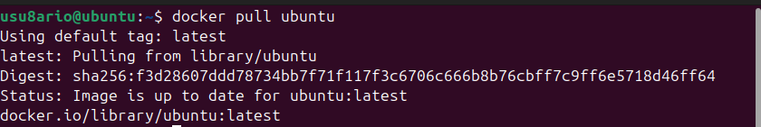
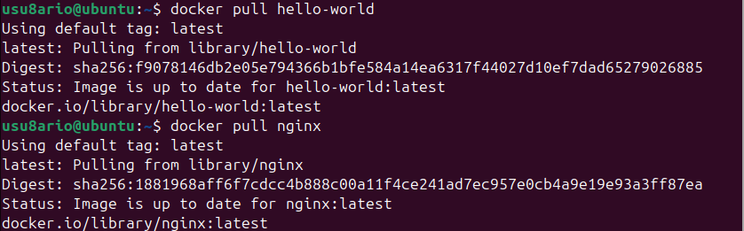
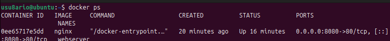
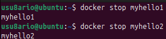
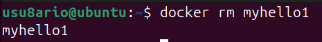
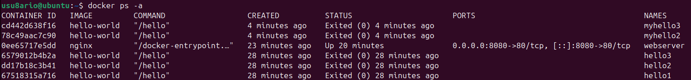
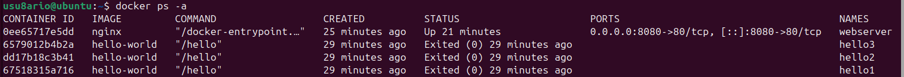

# Docker - Actividad 3: Imágenes y contenedores

## Introducción

En esta práctica se trabaja con la **gestión de imágenes Docker** y con el proceso completo de creación, nombrado y eliminación de contenedores. El objetivo es familiarizarse con el flujo de trabajo habitual: descargar imágenes desde Docker Hub, instanciarlas como contenedores y limpiar los recursos cuando ya no se necesitan.

---

## Recursos consultados

- http://www.servermom.org/pull-docker-images-run-docker-containers/3225/
- https://www.tecmint.com/remove-docker-images-containers-and-volumes/
- https://www.tecmint.com/name-docker-containers/
- https://training.play-with-docker.com/ops-s1-hello/

---

## Conceptos previos

**Imagen:** plantilla de solo lectura que contiene el sistema de archivos y la configuración necesaria para ejecutar una aplicación.

**Contenedor:** proceso aislado que se crea a partir de una imagen. Cada contenedor es independiente del resto.

**Docker Hub:** repositorio público donde se alojan imágenes oficiales y de la comunidad.

**Nombre de contenedor:** etiqueta legible que se asigna con `--name` para identificar el contenedor sin necesidad de usar su ID.

---

## Desarrollo de la práctica

### Tarea 1 - Descargar la imagen de Ubuntu

```bash
docker pull ubuntu
```

Descarga la versión más reciente de Ubuntu disponible en Docker Hub.

---

### Tarea 2 - Descargar la imagen de hello-world

```bash
docker pull hello-world
```

---

### Tarea 3 - Descargar la imagen de Nginx

```bash
docker pull nginx
```





---

### Tarea 4 - Listar las imágenes descargadas

```bash
docker images
```

Muestra todas las imágenes almacenadas localmente con su nombre, etiqueta, ID, fecha de creación y tamaño.

Resultado obtenido:
```
REPOSITORY    TAG       IMAGE ID       CREATED        SIZE
ubuntu        latest    e43e20a0b...   2 weeks ago    77.8MB
hello-world   latest    d2c94e258...   13 months ago  13.3kB
nginx         latest    a1be4ac8e...   2 weeks ago    187MB
```


---

### Tarea 5 - Crear el contenedor "myhello1"

```bash
docker run --name myhello1 hello-world
```

El contenedor se ejecuta, muestra el mensaje de bienvenida y finaliza automáticamente.

---

### Tarea 6 - Crear el contenedor "myhello2"

```bash
docker run --name myhello2 hello-world
```

---

### Tarea 7 - Crear el contenedor "myhello3"

```bash
docker run --name myhello3 hello-world
```


---

### Tarea 8 - Ver los contenedores activos

```bash
docker ps
```

La tabla aparece vacía porque los contenedores hello-world terminan en cuanto muestran su mensaje; no permanecen en ejecución.



---

### Tarea 9 - Detener "myhello1"

```bash
docker stop myhello1
```

---

### Tarea 10 - Detener "myhello2"

```bash
docker stop myhello2
```



---

### Tarea 11 - Eliminar "myhello1"

```bash
docker rm myhello1
```



---

### Tarea 12 - Ver todos los contenedores tras la eliminación

```bash
docker ps -a
```

Comprobamos que myhello1 ya no aparece en el listado, mientras que myhello2 y myhello3 siguen presentes en estado detenido.



---

### Tarea 13 - Eliminar el resto de contenedores

```bash
docker rm myhello2 myhello3
```

Es posible eliminar varios contenedores en un solo comando separando los nombres por espacios.


---

### Verificación final

```bash
docker ps -a
```

La tabla debe aparecer completamente vacía, confirmando que todos los contenedores han sido eliminados.



---

## Flujo completo de una imagen

```
Docker Hub
    │
    │  docker pull
    ▼
Imagen local
    │
    │  docker run --name
    ▼
Contenedor en ejecución
    │
    │  docker stop
    ▼
Contenedor detenido
    │
    │  docker rm
    ▼
Eliminado
```

---

## Tabla de comandos

| Comando | Función |
|---|---|
| `docker pull` | Descargar imagen desde Docker Hub |
| `docker images` | Listar imágenes locales |
| `docker run --name` | Crear contenedor con nombre |
| `docker ps` | Ver contenedores activos |
| `docker ps -a` | Ver todos los contenedores |
| `docker stop` | Detener contenedor |
| `docker rm` | Eliminar contenedor |
| `docker rmi` | Eliminar imagen |

---

## Buenas prácticas

Especificar siempre una versión concreta de la imagen en lugar de usar `latest`, ya que esto garantiza reproducibilidad:
```bash
docker pull ubuntu:24.04
```

Usar nombres descriptivos para los contenedores facilita su gestión:
```bash
docker run --name webserver nginx
```

Para limpiar recursos de forma masiva cuando ya no se necesitan:
```bash
docker container prune -f
docker image prune -f
```

---

## Problemas encontrados y soluciones

### Nombre de contenedor ya en uso

```
Error response from daemon: Conflict. The container name is already in use.
```

Solución: eliminar el contenedor anterior antes de crearlo de nuevo.
```bash
docker rm nombre
docker run --name nombre imagen
```

### Contenedor en ejecución no se puede eliminar

```bash
docker stop nombre
docker rm nombre
```

### Imagen no encontrada localmente

```bash
docker pull ubuntu
```

---

## Capturas de pantalla

| Archivo | Contenido |
|---|---|
| `pull-ubuntu.png` | Descarga de la imagen Ubuntu |
| `pull-images.png` | Descarga de hello-world y Nginx |
| `docker-images-list.png` | Listado de imágenes locales |
| `hello-three-containers.png` | Ejecución de los tres contenedores |
| `docker-ps-empty.png` | `docker ps` sin contenedores activos |
| `docker-stop-containers.png` | Detención de myhello1 y myhello2 |
| `docker-rm-container.png` | Eliminación de myhello1 |
| `docker-ps-after-rm.png` | Listado sin myhello1 |
| `docker-rm-all.png` | Eliminación de myhello2 y myhello3 |
| `docker-ps-final-empty.png` | Listado final vacío |

---

## Conclusión

En esta actividad se ha practicado el ciclo completo de gestión de imágenes y contenedores: descarga desde Docker Hub, creación con nombres personalizados, detención y eliminación. Conocer estos comandos es fundamental para mantener el entorno Docker ordenado y sin recursos innecesarios ocupando espacio.

---

**Álvaro Torroba Velasco**  
**Curso 2025/26**
