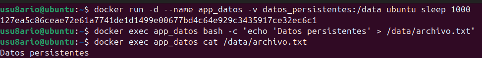
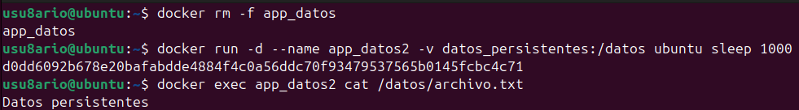
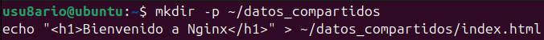
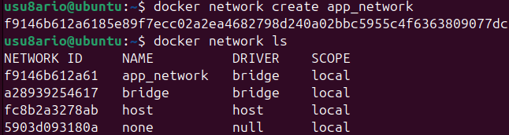
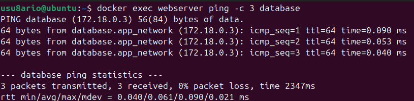
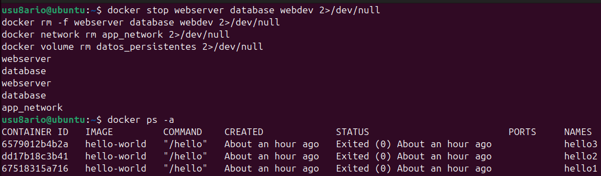

# Docker - Actividad 4: Almacenamiento y redes

## Introducción

En esta práctica se trabaja con dos aspectos fundamentales de Docker: el **almacenamiento persistente** mediante volúmenes y bind mounts, y la **comunicación entre contenedores** a través de redes personalizadas. Estas herramientas son esenciales para construir aplicaciones compuestas por varios servicios.

---

## Recursos consultados

- https://github.com/josedom24/curso_docker_ies
- https://docs.docker.com/storage/volumes/
- https://docs.docker.com/network/
- https://docs.docker.com/storage/storagedriver/

---

## Conceptos previos

**Volumen:** mecanismo de almacenamiento gestionado por Docker. Los datos almacenados en un volumen persisten aunque el contenedor sea eliminado.

**Bind mount:** monta un directorio del sistema host dentro del contenedor. Es útil en entornos de desarrollo porque cualquier cambio en el host se refleja de inmediato en el contenedor.

**Red Docker:** canal de comunicación aislado que permite que varios contenedores se descubran y se comuniquen entre sí usando sus nombres como identificadores.

---

## Parte 1: Volúmenes

### 1.1 Crear un volumen

```bash
docker volume create datos_persistentes
```

Docker gestiona el volumen internamente y lo almacena en `/var/lib/docker/volumes/`.

```bash
docker volume ls
```


---

### 1.2 Usar el volumen en un contenedor

```bash
docker run -d --name app_datos -v datos_persistentes:/data ubuntu sleep 1000
```

- `-v datos_persistentes:/data` monta el volumen en la ruta `/data` del contenedor
- `sleep 1000` mantiene el contenedor activo el tiempo suficiente para trabajar con él

Creamos un archivo dentro del volumen:

```bash
docker exec app_datos bash -c "echo 'Datos persistentes' > /data/archivo.txt"
docker exec app_datos cat /data/archivo.txt
```



---

### 1.3 Inspeccionar el volumen

```bash
docker volume inspect datos_persistentes
```

Devuelve información en JSON con la ruta física donde Docker almacena los datos, el driver utilizado y el ámbito del volumen.


---

### 1.4 Comprobar la persistencia

Eliminamos el contenedor original y creamos uno nuevo usando el mismo volumen:

```bash
docker rm -f app_datos
docker run -d --name app_datos2 -v datos_persistentes:/datos ubuntu sleep 1000
docker exec app_datos2 cat /datos/archivo.txt
```

El archivo sigue estando disponible aunque el contenedor anterior ya no existe. Esto demuestra que los datos sobreviven a la eliminación del contenedor.



---

## Parte 2: Bind Mount

### 2.1 Crear el directorio y el archivo en el host

```bash
mkdir -p ~/datos_compartidos
echo "<h1>Bienvenido a Nginx</h1>" > ~/datos_compartidos/index.html
cat ~/datos_compartidos/index.html
```



---

### 2.2 Ejecutar Nginx con bind mount

```bash
docker run -d --name webdev -p 8082:80 -v ~/datos_compartidos:/usr/share/nginx/html:ro nginx
```

- `-v ~/datos_compartidos:/usr/share/nginx/html:ro` monta el directorio del host en el directorio de archivos web de Nginx
- `:ro` indica que el contenedor solo puede leer, no escribir

```bash
curl http://localhost:8082
```


---

### 2.3 Modificar el archivo en el host y comprobar el resultado

```bash
echo "<h1>Contenido modificado desde el host</h1>" > ~/datos_compartidos/index.html
curl http://localhost:8082
```

El cambio se refleja en Nginx sin necesidad de reiniciar el contenedor. Esta es la principal ventaja del bind mount en desarrollo.


---

## Parte 3: Redes personalizadas

### 3.1 Crear una red

```bash
docker network create app_network
docker network ls
```

Se crea una red de tipo bridge aislada. Los contenedores dentro de esta red pueden comunicarse entre sí usando el nombre del contenedor como hostname.



---

### 3.2 Lanzar contenedores en la red

```bash
docker run -d --name webserver --network app_network -p 8082:80 nginx
docker run -d --name database --network app_network -e MYSQL_ROOT_PASSWORD=password mysql:5.7
```

Ambos contenedores pertenecen a `app_network` y pueden comunicarse directamente por nombre.

```bash
docker ps
```


---

### 3.3 Comprobar la comunicación entre contenedores

```bash
docker exec database mysql -u root -ppassword -e "SELECT 'Conexión exitosa'"
```

Los contenedores de la misma red se descubren automáticamente por nombre sin necesidad de conocer sus IPs.



---

### 3.4 Inspeccionar la red

```bash
docker network inspect app_network
```

El JSON resultante muestra los contenedores conectados, sus IPs asignadas dentro de la subred y la configuración del gateway.


---

## Limpieza de recursos

```bash
docker stop webserver database webdev app_datos2
docker rm -f webserver database webdev app_datos2
docker network rm app_network
docker volume rm datos_persistentes
docker ps -a
docker volume ls
docker network ls
```



---

## Comparativa de tipos de almacenamiento

| | Volumen | Bind Mount | tmpfs |
|---|---|---|---|
| Gestionado por Docker | Sí | No | Sí |
| Persistencia | Sí | Sí | No |
| Uso recomendado | Producción | Desarrollo | Datos temporales |
| Portabilidad | Alta | Depende del host | N/A |

---

## Tabla de comandos

### Volúmenes

| Comando | Función |
|---|---|
| `docker volume create` | Crear volumen |
| `docker volume ls` | Listar volúmenes |
| `docker volume inspect` | Ver detalles del volumen |
| `docker volume rm` | Eliminar volumen |
| `-v nombre:/ruta` | Montar volumen en contenedor |
| `-v /host:/cont:ro` | Bind mount de solo lectura |

### Redes

| Comando | Función |
|---|---|
| `docker network create` | Crear red personalizada |
| `docker network ls` | Listar redes |
| `docker network inspect` | Ver detalles de la red |
| `docker network rm` | Eliminar red |
| `--network nombre` | Asignar red al crear contenedor |
| `docker network connect` | Conectar contenedor a una red |

---

## Buenas prácticas

Usar volúmenes en lugar de bind mounts en producción para garantizar portabilidad:
```bash
docker volume create postgres_data
docker run -d -v postgres_data:/var/lib/postgresql/data postgres
```

Crear redes personalizadas para cada aplicación multi-contenedor en lugar de usar la red bridge por defecto:
```bash
docker network create backend_network
docker run -d --network backend_network --name api app
docker run -d --network backend_network --name db mysql
```

Usar `:ro` cuando el contenedor no necesita escribir en el directorio montado:
```bash
docker run -v ~/config:/etc/app:ro app
```

---

## Problemas encontrados y soluciones

### El volumen ya existe

```bash
docker volume rm nombre_volumen
docker volume create nombre_volumen
```

### La red ya existe

```bash
docker network rm nombre_red
docker network create nombre_red
```

### Los contenedores no se comunican por nombre

Verificar que ambos están en la misma red:
```bash
docker network inspect nombre_red
docker network connect nombre_red contenedor
```

---

## Capturas de pantalla

| Archivo | Contenido |
|---|---|
| `volumen-create.png` | Creación e inspección del volumen |
| `volumen-datos.png` | Datos escritos dentro del volumen |
| `volumen-inspect.png` | Detalles del volumen en JSON |
| `volumen-persistencia.png` | Datos accesibles desde nuevo contenedor |
| `bindmount-create.png` | Directorio y archivo creados en el host |
| `bindmount-nginx.png` | Nginx sirviendo el archivo del host |
| `bindmount-update.png` | Cambios reflejados sin reiniciar |
| `network-create.png` | Red personalizada creada |
| `network-containers.png` | Contenedores activos en la red |
| `network-communication.png` | Comunicación entre contenedores |
| `network-inspect.png` | Detalles de la red en JSON |
| `cleanup.png` | Limpieza completa de recursos |

---

## Conclusión

En esta actividad se han trabajado los dos mecanismos de almacenamiento principales de Docker (volúmenes y bind mounts) y la creación de redes personalizadas para la comunicación entre contenedores. Estos conceptos son la base para desplegar aplicaciones reales formadas por múltiples servicios, como se verá en las siguientes actividades con Docker Compose.

---

**Álvaro Torroba Velasco**
**Curso 2025/26**
