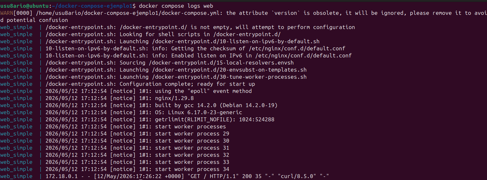
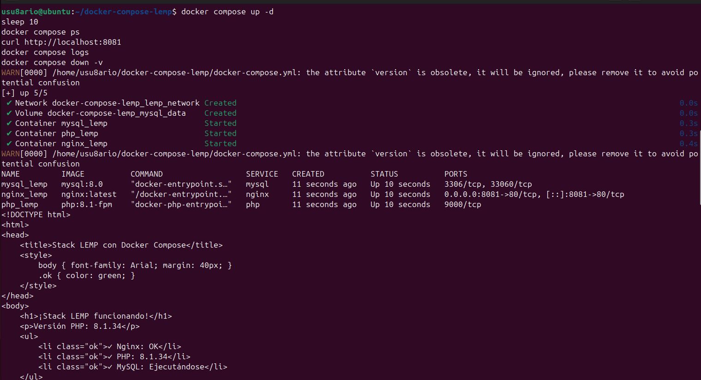
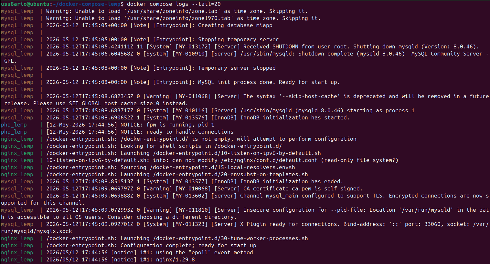

# Docker - Actividad 5: Docker Compose

## Introducción

En esta práctica se trabaja con **Docker Compose**, la herramienta oficial para definir y ejecutar aplicaciones formadas por múltiples contenedores. En lugar de lanzar cada contenedor manualmente, Docker Compose permite describir toda la infraestructura en un archivo YAML y levantarla con un solo comando.

---

## Recursos consultados

- https://docs.docker.com/compose/
- https://github.com/josedom24/curso_docker_ies
- https://docs.docker.com/compose/compose-file/

---

## Conceptos previos

**Docker Compose:** herramienta que lee un archivo `docker-compose.yml` y gestiona el ciclo de vida de todos los servicios definidos en él.

**Servicio:** cada contenedor que forma parte de la aplicación (servidor web, base de datos, caché, etc.).

**Red interna:** Docker Compose crea automáticamente una red compartida entre los servicios, que se comunican entre sí usando el nombre del servicio como hostname.

**Volumen:** almacenamiento persistente declarado en el propio fichero Compose para que los datos sobrevivan a reinicios.

---

## Verificación de Docker Compose

```bash
docker compose version
```

En Docker Compose V2 el comando es `docker compose` (sin guión). La versión debe ser v2.x o superior.


---

## Ejemplo 1: Nginx simple

### Estructura del proyecto

```bash
mkdir -p ~/docker-compose-ejemplo1/html
cd ~/docker-compose-ejemplo1
echo "<h1>Hola desde Docker Compose</h1>" > html/index.html
```

### Archivo docker-compose.yml

```yaml
services:
  web:
    image: nginx:latest
    ports:
      - "8080:80"
    volumes:
      - ./html:/usr/share/nginx/html:ro
    container_name: web_simple
    restart: always
```

### Arrancar los servicios

```bash
docker compose up -d
```

### Ver el estado

```bash
docker compose ps
```


### Comprobar el acceso

```bash
curl http://localhost:8080
```


### Ver los logs

```bash
docker compose logs web
```



### Detener y eliminar

```bash
docker compose down
```

---

## Ejemplo 2: Stack LEMP (Nginx + PHP + MySQL)

### Estructura del proyecto

```bash
mkdir -p ~/docker-compose-lemp/app
cd ~/docker-compose-lemp
```

### Archivo docker-compose.yml

```yaml
services:
  nginx:
    image: nginx:latest
    ports:
      - "8081:80"
    volumes:
      - ./app:/var/www/html
      - ./nginx.conf:/etc/nginx/conf.d/default.conf:ro
    depends_on:
      - php
    networks:
      - lemp_network
    container_name: nginx_lemp
    restart: always

  php:
    image: php:8.1-fpm
    volumes:
      - ./app:/var/www/html
    networks:
      - lemp_network
    container_name: php_lemp
    restart: always

  mysql:
    image: mysql:8.0
    environment:
      MYSQL_ROOT_PASSWORD: rootpass
      MYSQL_DATABASE: miapp
    volumes:
      - mysql_data:/var/lib/mysql
    networks:
      - lemp_network
    container_name: mysql_lemp
    restart: always

volumes:
  mysql_data:

networks:
  lemp_network:
    driver: bridge
```

### Configuración de Nginx (nginx.conf)

```nginx
server {
    listen 80;
    server_name _;
    root /var/www/html;
    index index.php index.html;

    location ~ \.php$ {
        fastcgi_pass php:9000;
        fastcgi_index index.php;
        fastcgi_param SCRIPT_FILENAME $document_root$fastcgi_script_name;
        include fastcgi_params;
    }

    location / {
        try_files $uri $uri/ =404;
    }
}
```

### Archivo PHP de prueba (app/index.php)

```php
<!DOCTYPE html>
<html>
<head><title>Stack LEMP</title></head>
<body>
    <h1>Stack LEMP funcionando con Docker Compose</h1>
    <p>PHP: <?php echo phpversion(); ?></p>
</body>
</html>
```

### Arrancar el stack

```bash
docker compose up -d
docker compose ps
```


### Comprobar el acceso

```bash
curl http://localhost:8081
```



### Ver los logs de todos los servicios

```bash
docker compose logs --tail=20
```



### Detener y eliminar incluyendo volúmenes

```bash
docker compose down -v
```

---

## Ejemplo 3: Uso de variables de entorno (.env)

### Archivo .env

```env
APP_PORT=3000
APP_NAME=MyApp
APP_ENV=development
DB_HOST=db
DB_PASSWORD=secretpass
DB_NAME=myappdb
```

### Archivo docker-compose.yml

```yaml
services:
  app:
    image: nginx:latest
    ports:
      - "${APP_PORT}:80"
    environment:
      - APP_NAME=${APP_NAME}
      - APP_ENV=${APP_ENV}
    volumes:
      - ./html:/usr/share/nginx/html:ro
    container_name: app_config
    restart: always
```

Las variables del archivo `.env` se sustituyen automáticamente en el YAML. Para ver el resultado final con las variables ya resueltas:

```bash
docker compose config
```

### Arrancar y comprobar

```bash
docker compose up -d
curl http://localhost:3000
docker compose ps
docker compose down
```

---

## Estructura de un docker-compose.yml

```yaml
services:
  nombre_servicio:
    image: imagen:version
    ports:
      - "host:contenedor"
    volumes:
      - volumen:/ruta/contenedor
    environment:
      - VARIABLE=valor
    depends_on:
      - otro_servicio
    networks:
      - nombre_red
    restart: always

volumes:
  volumen:

networks:
  nombre_red:
    driver: bridge
```

---

## Tabla de comandos

| Comando | Función |
|---|---|
| `docker compose up -d` | Crear e iniciar todos los servicios en background |
| `docker compose down` | Detener y eliminar contenedores y redes |
| `docker compose down -v` | Igual que el anterior, borrando también los volúmenes |
| `docker compose ps` | Ver el estado de los servicios |
| `docker compose logs` | Ver los logs de los servicios |
| `docker compose logs -f` | Seguir los logs en tiempo real |
| `docker compose exec` | Ejecutar un comando en un servicio |
| `docker compose build` | Construir las imágenes definidas en el Compose |
| `docker compose pull` | Descargar las imágenes del Compose |
| `docker compose config` | Ver la configuración final con variables resueltas |
| `docker compose stop` | Detener los servicios sin eliminarlos |
| `docker compose start` | Arrancar servicios previamente detenidos |
| `docker compose restart` | Reiniciar los servicios |

---

## Buenas prácticas

Especificar siempre la versión de la imagen para evitar comportamientos inesperados al actualizar:
```yaml
image: mysql:8.0   # en lugar de mysql o mysql:latest
```

Declarar redes explícitas para los servicios que necesitan comunicarse:
```yaml
networks:
  app_net:
    driver: bridge
```

Usar archivos `.env` para separar la configuración del código y facilitar el despliegue en distintos entornos.

Usar `depends_on` para controlar el orden de arranque cuando un servicio depende de otro:
```yaml
depends_on:
  - db
```

---

## Problemas encontrados y soluciones

### Puerto ya en uso

Cambiar el puerto del host en el `docker-compose.yml`:
```yaml
ports:
  - "8081:80"
```

### Los cambios en el código no se reflejan

```bash
docker compose down -v
docker compose up -d --build
```

### Los servicios no se comunican entre sí

Verificar que están definidos en la misma red y que se referencian por el nombre del servicio, no por IP.

---

## Capturas de pantalla

| Archivo | Contenido |
|---|---|
| `docker-compose-version.png` | Versión de Docker Compose instalada |
| `compose-simple-ps.png` | Estado del ejemplo 1 (Nginx) |
| `compose-simple-curl.png` | Acceso al servicio Nginx |
| `compose-simple-logs.png` | Logs del ejemplo 1 |
| `compose-lemp-ps.png` | Estado del stack LEMP (3 servicios) |
| `compose-lemp-curl.png` | Acceso a la aplicación PHP |
| `compose-lemp-logs.png` | Logs del stack LEMP |

---

## Conclusión

Docker Compose simplifica enormemente la gestión de aplicaciones multi-contenedor. Con un único archivo YAML se define toda la infraestructura (servicios, redes, volúmenes y variables) y se puede arrancar, detener e inspeccionar con comandos sencillos. Es la herramienta estándar para entornos de desarrollo y la base para orquestadores más avanzados como Kubernetes.

---

**Álvaro Torroba Velasco**
**Curso 2025/26**
