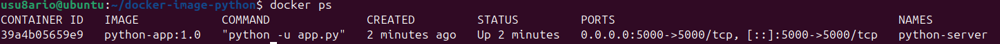
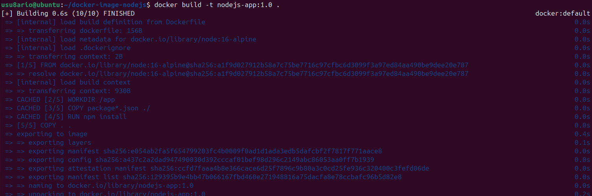
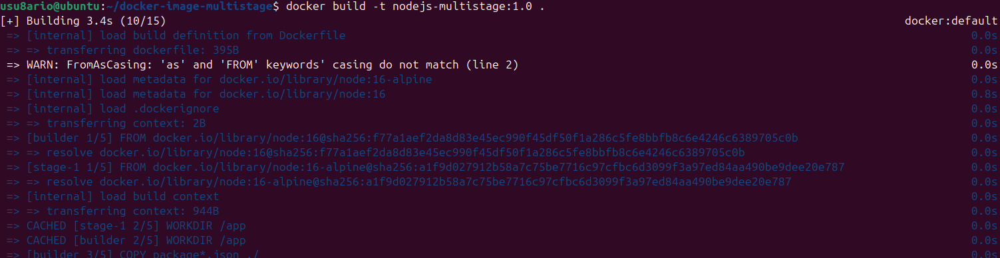
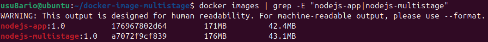
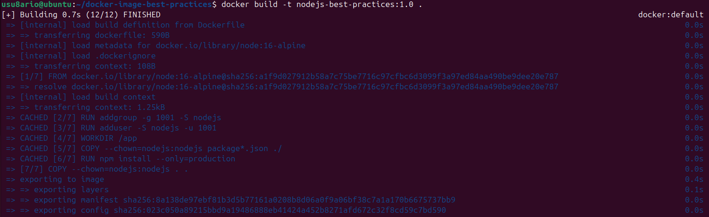
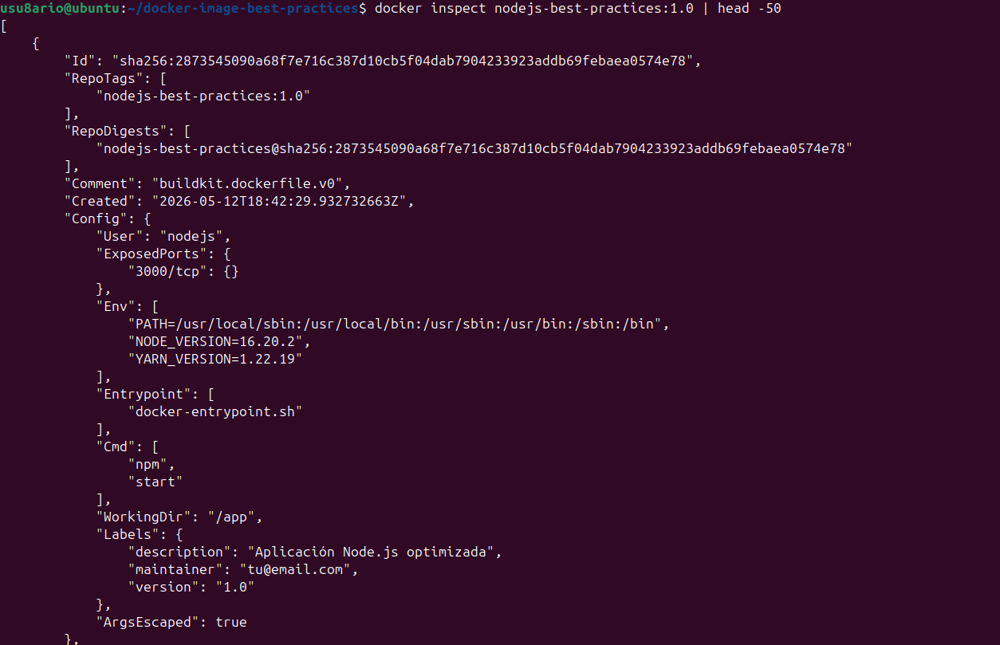
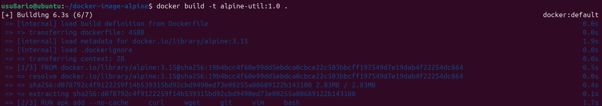
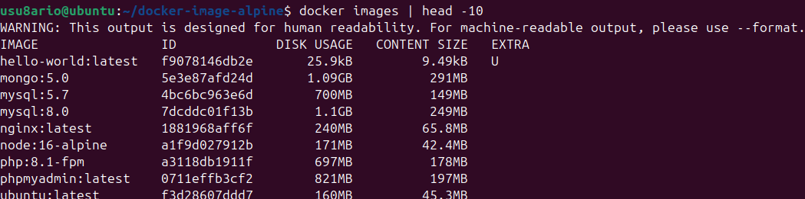

# Docker - Actividad 6: Creación de imágenes

## Introducción

En esta práctica se trabaja con la **creación de imágenes Docker personalizadas** mediante `Dockerfile`. Se construyen imágenes para distintos lenguajes y entornos, aplicando técnicas de optimización como el multi-stage build y el uso de imágenes base ligeras.

---

## Recursos consultados

- https://docs.docker.com/engine/reference/builder/
- https://docs.docker.com/develop/dev-best-practices/dockerfile_best-practices/
- https://github.com/josedom24/curso_docker_ies

---

## Conceptos previos

**Dockerfile:** archivo de texto con instrucciones secuenciales que Docker ejecuta para construir una imagen.

**Capa:** cada instrucción del Dockerfile genera una capa que se apila sobre las anteriores. Docker las cachea para acelerar construcciones posteriores.

**Contexto de construcción:** directorio desde el que se lanza `docker build`. Docker envía su contenido al daemon para construir la imagen.

**Multi-stage build:** técnica que usa varias etapas `FROM` en un mismo Dockerfile para separar la fase de compilación de la imagen final, reduciendo su tamaño.

---

## Instrucciones principales del Dockerfile

| Instrucción | Función | Ejemplo |
|---|---|---|
| `FROM` | Imagen base | `FROM python:3.9-slim` |
| `WORKDIR` | Directorio de trabajo | `WORKDIR /app` |
| `COPY` | Copiar archivos del host | `COPY app.py .` |
| `RUN` | Ejecutar comando durante la construcción | `RUN pip install -r requirements.txt` |
| `EXPOSE` | Documentar el puerto que usa la app | `EXPOSE 5000` |
| `ENV` | Variable de entorno | `ENV NODE_ENV=production` |
| `CMD` | Comando por defecto al arrancar | `CMD ["python", "app.py"]` |
| `LABEL` | Metadatos de la imagen | `LABEL version="1.0"` |
| `USER` | Usuario que ejecuta el proceso | `USER nodejs` |
| `ENTRYPOINT` | Punto de entrada fijo | `ENTRYPOINT ["python"]` |

---

## Ejemplo 1: Aplicación Python

### Estructura

```bash
mkdir -p ~/docker-image-python
cd ~/docker-image-python
```

### Dockerfile

```dockerfile
FROM python:3.9-slim

WORKDIR /app

COPY requirements.txt .

RUN pip install --no-cache-dir -r requirements.txt

COPY app.py .

EXPOSE 5000

CMD ["python", "-u", "app.py"]
```

### requirements.txt

```
flask==2.0.1
```

### app.py

```python
from http.server import HTTPServer, SimpleHTTPRequestHandler

class MyHandler(SimpleHTTPRequestHandler):
    def do_GET(self):
        self.send_response(200)
        self.send_header('Content-type', 'text/html')
        self.end_headers()
        self.wfile.write(b'''
        <!DOCTYPE html>
        <html>
        <body>
            <h1>Python en Docker</h1>
            <p>Simple HTTP Server</p>
        </body>
        </html>
        ''')

server = HTTPServer(('0.0.0.0', 5000), MyHandler)
print('Server running on port 5000...')
server.serve_forever()
```

### Construcción y ejecución

```bash
docker build -t python-app:1.0 .
docker run -d --name python-server -p 5000:5000 python-app:1.0
sleep 3 && curl http://localhost:5000
docker logs python-server
docker history python-app:1.0
docker rm -f python-server
```





---

## Ejemplo 2: Aplicación Node.js

### Estructura

```bash
mkdir -p ~/docker-image-nodejs
cd ~/docker-image-nodejs
```

### Dockerfile

```dockerfile
FROM node:16-alpine

WORKDIR /app

COPY index.js .

EXPOSE 3000

CMD ["node", "index.js"]
```

### index.js

```javascript
const http = require('http');

const server = http.createServer((req, res) => {
    res.writeHead(200, {'Content-Type': 'text/html'});
    res.end(`
        <!DOCTYPE html>
        <html>
        <body>
            <h1>Node.js en Docker</h1>
            <p>Servidor HTTP simple</p>
        </body>
        </html>
    `);
});

server.listen(3000, () => {
    console.log('Servidor ejecutándose en puerto 3000');
});
```

### Construcción y ejecución

```bash
docker build -t nodejs-app:1.0 .
docker run -d --name nodejs-server -p 3000:3000 nodejs-app:1.0
sleep 3 && curl http://localhost:3000
docker logs nodejs-server
docker rm -f nodejs-server
```




---

## Ejemplo 3: Multi-stage build

El multi-stage build permite usar una imagen grande en la fase de compilación y copiar solo los archivos necesarios a una imagen final más ligera.

### Estructura

```bash
mkdir -p ~/docker-image-multistage
cd ~/docker-image-multistage
```

### Dockerfile

```dockerfile
# Etapa 1: compilación
FROM node:16 as builder

WORKDIR /app

COPY package*.json ./
RUN npm install

COPY . .

# Etapa 2: imagen final ligera
FROM node:16-alpine

WORKDIR /app

COPY --from=builder /app/node_modules ./node_modules
COPY --from=builder /app/package*.json ./
COPY --from=builder /app/index.js ./

EXPOSE 3000

CMD ["npm", "start"]
```

### package.json

```json
{
  "name": "nodejs-multistage",
  "version": "1.0.0",
  "main": "index.js",
  "scripts": {
    "start": "node index.js"
  },
  "dependencies": {
    "express": "^4.18.2"
  }
}
```

### index.js

```javascript
const http = require('http');

const server = http.createServer((req, res) => {
    res.writeHead(200, {'Content-Type': 'text/html'});
    res.end('<h1>Multi-stage build optimizado</h1>');
});

server.listen(3000, () => {
    console.log('Servidor multi-stage corriendo');
});
```

### Construcción y comparación de tamaños

```bash
docker build -t nodejs-multistage:1.0 .
docker images | grep -E "nodejs-app|nodejs-multistage"
```

La imagen multi-stage ocupa menos espacio porque la etapa final solo incluye lo necesario para ejecutar la aplicación, sin las herramientas de compilación.





---

## Ejemplo 4: Dockerfile con buenas prácticas

Este ejemplo aplica varias recomendaciones de seguridad y optimización: imagen base ligera, usuario no root, `.dockerignore` y metadatos con `LABEL`.

### .dockerignore

```
node_modules
npm-debug.log
.git
.gitignore
README.md
.env
```

### Dockerfile

```dockerfile
FROM node:16-alpine

LABEL maintainer="alvaro@example.com"
LABEL version="1.0"
LABEL description="Aplicación Node.js optimizada"

RUN addgroup -g 1001 -S nodejs && \
    adduser -S nodejs -u 1001

WORKDIR /app

COPY --chown=nodejs:nodejs index.js .

EXPOSE 3000

USER nodejs

CMD ["node", "index.js"]
```

### Construcción y verificación

```bash
docker build -t nodejs-best-practices:1.0 .
docker inspect nodejs-best-practices:1.0 | head -50
docker run --rm nodejs-best-practices:1.0 whoami
```

El comando `whoami` debe devolver `nodejs`, confirmando que el proceso no se ejecuta como root. Esto limita el daño potencial si el contenedor fuera comprometido.






---

## Ejemplo 5: Imagen Alpine mínima

Alpine Linux es una distribución extremadamente ligera (~5MB base) ideal para contenedores de utilidades.

### Estructura

```bash
mkdir -p ~/docker-image-alpine
cd ~/docker-image-alpine
```

### Dockerfile

```dockerfile
FROM alpine:3.15

RUN apk add --no-cache \
    curl \
    wget \
    git \
    vim \
    bash

RUN echo "#!/bin/sh" > /entrypoint.sh && \
    echo "echo 'Alpine Linux Utility Container'" >> /entrypoint.sh && \
    echo "exec /bin/sh" >> /entrypoint.sh && \
    chmod +x /entrypoint.sh

ENTRYPOINT ["/entrypoint.sh"]
```

### Construcción y prueba

```bash
docker build -t alpine-util:1.0 .
docker images | grep alpine-util
docker run --rm alpine-util:1.0 curl --version
```




---

## Comparativa de tamaños de imágenes

| Imagen base | Tamaño aproximado |
|---|---|
| `alpine:3.15` | ~5MB |
| `node:16-alpine` | ~130MB |
| `python:3.9-slim` | ~150MB |
| `node:16` | ~900MB |
| `ubuntu:22.04` | ~80MB |

Elegir la imagen base adecuada tiene un impacto directo en el tiempo de descarga, el espacio en disco y la superficie de ataque.

---

## Buenas prácticas

Usar imágenes base ligeras siempre que sea posible:
```dockerfile
FROM alpine:3.15      # en lugar de ubuntu:22.04
FROM node:16-alpine   # en lugar de node:16
```

Combinar comandos `RUN` para reducir el número de capas:
```dockerfile
# Recomendado
RUN apt-get update && \
    apt-get install -y curl && \
    apt-get clean

# No recomendado (genera 3 capas)
RUN apt-get update
RUN apt-get install -y curl
RUN apt-get clean
```

Especificar siempre la versión de la imagen base:
```dockerfile
FROM node:16-alpine   # en lugar de FROM node
```

Usar `.dockerignore` para excluir archivos innecesarios del contexto de construcción.

Ejecutar el proceso con un usuario sin privilegios:
```dockerfile
RUN addgroup -g 1001 -S app && adduser -S app -u 1001
USER app
```

---

## Limpieza

```bash
docker rmi python-app:1.0 nodejs-app:1.0 nodejs-multistage:1.0 nodejs-best-practices:1.0 alpine-util:1.0
docker images
```



---

## Capturas de pantalla

| Archivo | Contenido |
|---|---|
| `build-python.png` | Construcción de la imagen Python |
| `python-running.png` | Contenedor Python activo |
| `python-logs.png` | Logs del servidor Python |
| `python-history.png` | Historial de capas de la imagen Python |
| `build-nodejs.png` | Construcción de la imagen Node.js |
| `nodejs-running.png` | Contenedor Node.js activo |
| `nodejs-logs.png` | Logs del servidor Node.js |
| `build-multistage.png` | Construcción multi-stage |
| `images-comparison.png` | Comparación de tamaños de imágenes |
| `build-best-practices.png` | Construcción con buenas prácticas |
| `inspect-image.png` | Inspección de la imagen optimizada |
| `user-check.png` | Verificación de usuario no root |
| `build-alpine.png` | Construcción de imagen Alpine |
| `alpine-size.png` | Tamaño de la imagen Alpine |
| `alpine-running.png` | Contenedor Alpine con herramientas |
| `final-cleanup.png` | Estado final tras limpiar imágenes |

---

## Conclusión

En esta actividad se han creado imágenes Docker para Python, Node.js y Alpine, aplicando técnicas de optimización como el multi-stage build, el uso de imágenes base ligeras y la ejecución con usuarios sin privilegios. Conocer estas prácticas es fundamental para construir imágenes seguras, portables y eficientes en entornos reales.

---

**Álvaro Torroba Velasco**
**Curso 2025/26**
